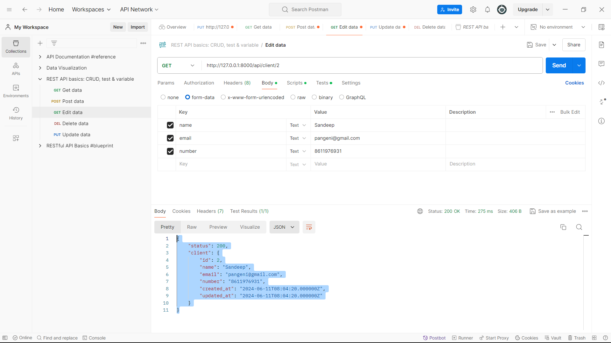

## Documentation for REST API 

REST API communicate with HTTP requests to perform standard database functions like creating, reading, updating and deleting records. All HTTP methods can be used in API calls. A well-designed REST API is similar to a website running in a web browser with built-in HTTP functionality.

In API the state of resource can be delivered to a client in virtually in any format like JSON, HTML, PHP or plain Text. Request headers and parameters are also important in REST API calls because they include important identifier information such as URIs, caching, cookies, authorizations, metadata and more. Request headers and response headers, along with conventional HTTP status codes, are used within well-designed REST APIs.
## Securing REST API
Securing REST API also starts with industry best practices. Use hashing algorithms for password security and HTTPS for secure data transmission. An authorization framework can help limit the privileges of third-party applications. Using a timestamp in the HTTP header, an API can also reject any request that arrives after a certain time period. Parameter validation and JSON Web Tokens are other ways to ensure that only authorized clients can access the API.

## A REST API would use: 

- A GET request to retrieve a record. 

- A POST request to creates a new record.

- A POST request to validate record.

- A EDIT records to GET request for edit.

- A PUT request to updates a record. 

 

- A DELETE request to delete. 

 

 - A Deleted records in GET method.

  